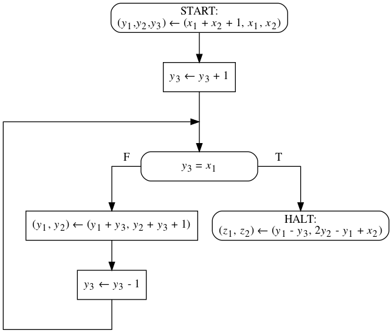
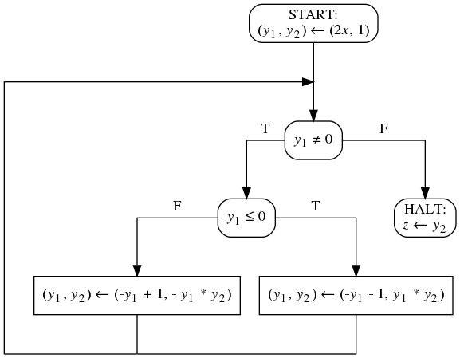

# Упражнения по теме "Метод индуктивных утверждений"

1. Вам дана блок-схема над 2 входными, 3 промежуточными и 2 выходными переменными. Домены всех переменных - множество всех целых чисел. Вам дана спецификация над этими же переменными. При помощи метода индуктивных утверждений докажите, что блок-схема частично корректна относительно спецификации.
<code>&straightphi;(x&#8321;, x&#8322;) &equiv; x&#8322; &ge; 0</code>
<code>&psi;(x&#8321;, x&#8322;, z&#8321;, z&#8322;) &equiv; z&#8321; - x&#8321; = z&#8322; - x&#8322;</code>

1. Вам дана блок-схема над 1 входной, 2 промежуточными и 1 выходной переменными. Домены всех переменных - множество всех целых чисел. Вам дана спецификация над этими же переменными. При помощи метода индуктивных утверждений докажите, что блок-схема частично корректна относительно спецификации.
<code>&straightphi;(x) &equiv; x &ge; 0</code>
<code>&psi;(x, z) &equiv; z = (2x)!</code>

1. Какое требуется минимальное число точек сечения, чтобы доказать частичную корректность хотя бы одной блок-схемы, имеющей указанные особенности, относительно хотя бы одной спецификации при помощи методов Флойда, если блок-схемы с указанными особенностями существуют.
Если ответ зависит от спецификации, привести не менее двух разных ответов и обосновать их.
    1. блок-схема содержит 2 цикла;
    1. блок-схема содержит не менее одного оператора соединения;
    1. блок-схема зацикливается на всех значениях входных данных из своих доменов;
    1. операторы и связки блок-схемы разбиваются на 3 независимые связные части так, что первая и вторая часть обладают единственной общей связкой, вторая и третья часть обладают единственной общей связкой, а первая и третья часть не обладают общими связками. Общих операторов у частей нет.
