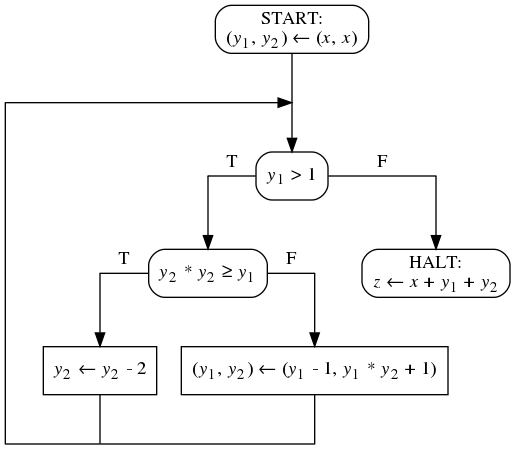
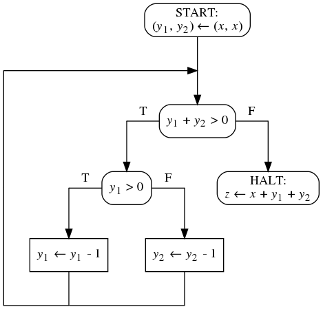
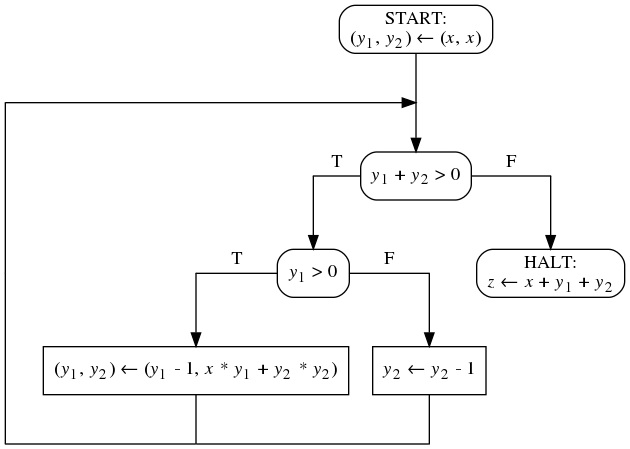
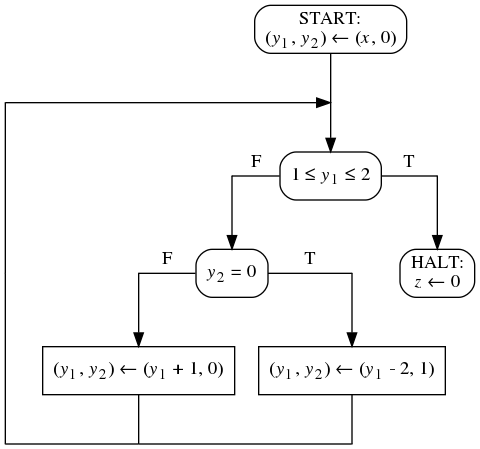

# Упражнения по теме "Метод фундированных множеств"

1. Вам дана блок-схема над 1 входной, 2 промежуточными и 1 выходной переменной. Домены всех переменных - множество всех целых чисел. Вам дана спецификация над этими же переменными. При помощи методов Флойда докажите, что блок-схема полностью корректна относительно спецификации.
<code>&straightphi;(x) &equiv; x > 0</code>
<code>&psi;(x, z) &equiv; z > x</code>

1. Вам дана блок-схема над 1 входной, 2 промежуточными переменными. Домены всех переменных - множество всех целых чисел. Вам дано предусловие над этими же переменными. При помощи методов Флойда докажите, что блок-схема завершается на этом предусловии.
<code>&straightphi;(x) &equiv; x &ge; 0</code>

1. Вам дана блок-схема над 1 входной, 2 промежуточными переменными. Домены всех переменных - множество всех целых чисел. Вам дано предусловие над этими же переменными. При помощи методов Флойда докажите, что блок-схема завершается на этом предусловии.
<code>&straightphi;(x) &equiv; x &ge; 0</code>

1. Вам дана блок-схема над 1 входной, 2 промежуточными переменными. Домены всех переменных - множество всех целых чисел. Вам дано предусловие над этими же переменными. При помощи методов Флойда докажите, что блок-схема завершается на этом предусловии.
<code>&straightphi;(x) &equiv; x &gt; 0</code>

1. Пусть у нас есть блок-схема и предусловие. Завершаемость блок-схемы на этом предусловии доказана по методу фундированных множеств с выбранным фундированным множеством `(U, a)` и выбранными оценочными функциями ui. Возможно ли доказать завершаемость тем же методом с использованием тех же точек сечения и _тождественных_ функций в качестве оценочных? Если да, то сделайте это на каком-нибудь примере и для всех случаев.
