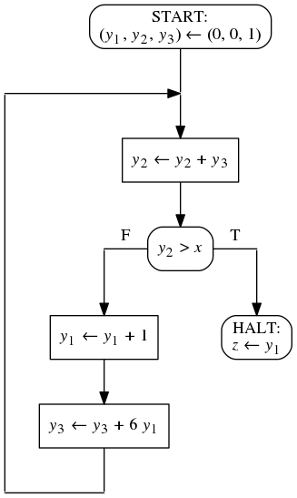
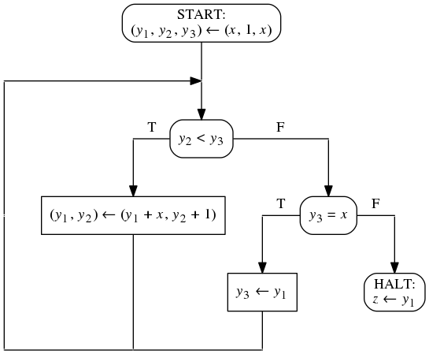

Это задание состоит из 3-х частей. Нужно выполнить все части.

## Задание 1.1

1. Установите инструменты Frama-C, Why3, AstraVer и солверы
   согласно [инструкции](https://forge.ispras.ru/projects/astraver/wiki).
   Устанавливать Coq и CoqIDE не нужно. Установите солвер CVC4.
2. Познакомьтесь с языком Why3 по [этому документу](http://why3.lri.fr/manual.pdf). Обратите внимание, что в нем описывается язык версии 1.3, а наши
   инструменты поддерживают версию 0.87. Часть синтаксиса изменилась.
3. Ниже описаны программы `P1` и `P2` и требования `T1` и `T2`.

   1. Промоделируйте (на листочке) программы `P1` и `P2` в виде блок-схем.
      Все переменные блок-схем должны иметь домен всех целых чисел.
   2. Промоделируйте (на листочке) требования `T1` и `T2` в виде предусловий
      и постусловий.
   3. Определите все пары программ и требований, которые находятся в отношении
      частичной корректности. Докажите эти факты (на листочке).
   4. Определите все пары программ и требований, которые находятся в отношении
      полной корректности. Докажите эти факты (на листочке).
   5. Оформите каждое доказательство в виде теории Why3. Цель теории -- доказать
      нужное отношение соответствия. Результат вашей работы -- это архив
      следующего состава: файл со всеми теориями, сессия доказательства всех
      теорий, фото блок-схем и фото доказательств с листочка.
      В начале файла с теориями поместите комментарий, обосновывающий
      отсутствие частичной корректности и полной корректности для всех пар
      программ и требований, не включенных в файл.

Входом _Программы P1_ являются три целых числа, выходом -- одно число.
Программа отнимает от первого числа третье и затем прибавляет к полученному
второе число. Так получается выходное число.
Все вычисления делаются в машинной арифметике в целых числах от -128 до 127.
Сумма и вычитание -- это бинарные операции над такими
целыми числами, их результаты -- такие же числа. Операции не определены для
случая переполнения (блок-схема зацикливается при переполнении).

Входы и выходы _Программы Р2_ те же, что и у _Программа Р1_. Ее цель --
вычислить то же выражение. Она сравнивает значения входных чисел и выбирает
такой порядок суммы и вычитания, чтобы не случилось переполнение всегда,
когда лишь результат всего искомого
выражения представим данными целыми числами. Попробуйте самостоятельно
составить такую программу. Она использует ту же машинную арифметику, что и
_Программа Р1_.

_Требования Т1_ применимы к программам с тремя входными переменными
(назовем их _x1_, _x2_, _x3_) и одной выходной переменной. Домены всех
переменных -- множество всех целых чисел. Программа должна вычислять
значение выражения _x1_ + _x2_ - _x3_.
Программа не должна зацикливаться или вычислять другое значение, если
значение выражений _x1_ - _x3_ и _x1_ + _x2_ - _x3_ представимы
в типе указанных выше ограниченных целых чисел.

_Требования Т2_ применимы к программам с тремя входными переменными
(назовем их _x1_, _x2_, _x3_) и одной выходной переменной. Домены всех
переменных -- множество всех целых чисел. Программа вычисляет значение
выражения _x1_ + _x2_ - _x3_.
Программа не должна зацикливаться или вычислять другое значение, если
значение выражения _x1_ + _x2_ - _x3_ представимо
в типе указанных выше ограниченных целых чисел.

_Прагматика_ Это задание знакомит вас со средой верификации,
которой вы будете пользоваться в дальнейшем для верификации Си-программ.
Конкретнее, по Си-программе и спецификации к ней будут строиться
утверждения, означающие правильность программы. Утверждения будут
строиться на языке Why3 и доказываться в среде Why3 IDE. Знание этого
языка вам потребуется, чтобы читать и понимать утверждения, которые
будут генерировать инструменты верификации. Среда Why3 IDE дает
возможность использовать сразу несколько солверов для верификации. Они
отличаются языками, на которых нужно записывать доказываемые утверждения,
способами запуска и управления. Разобраться со всеми этими отличиями
берет на себя среда Why3 IDE. Вам она предоставляет унифицированный
интерфейс управления солверами и единый язык (Why3), который она сама
будет транслировать во входные языки солверов.

## Задание 1.2

Вам дана блок-схема и спецификация к ней. При помощи
метода индуктивных утверждений докажите частичную корректность этой
блок-схемы относительно этой спецификации. Результатом вашей работы будет
такой же архив, как и в задании 1.1. На фото блок-схемы укажите
точки сечения. Индуктивные утверждения оформите в виде предикатов.

Множество переменных <code>V = { <i>x</i>, <i>y</i>1,
<i>y</i>2, <i>y</i>3, <i>z</i> }</code> состоит
из одной входной, трех промежуточных и одной выходной переменных.
Доменом всех переменных является множество всех целых чисел.
На рисунке представлена блок-схема программы над множеством переменных
<code>V</code>, вычисляющая целую часть кубического корня.

<code>&straightphi;(x) &equiv; x &ge; 0</code>

<code>&psi;(x, z) &equiv; z3 &le; x &lt; (z + 1)3</code>

_Прагматика_ Это задание позволяет отработать метод индуктивных
утверждений. Он потребуется вам, чтобы верифицировать Си-программы с циклами.

## Задание 1.3

Вам дана блок-схема и спецификация к ней. При помощи
метода фундированных множеств докажите завершаемость этой блок-схемы
относительно этой спецификации. Результатом вашей работы будет такой же архив,
как и в задании 1.1. На фото блок-схемы укажите точки сечения.
Фундированное множество, индуктивные утверждения и оценочные функции
оформите соответствующим способом в файле с теориями. Не забудьте доказать
фундированность множества (это тоже будут цели).

Множество переменных <code>V = { <i>x</i>, <i>y</i>1,
<i>y</i>2, <i>y</i>3, <i>z</i> }</code> состоит
из одной входной, трех промежуточных и одной выходной переменных.
Доменом всех переменных является множество всех целых чисел. На рисунке
представлена блок-схема программы над множеством переменных <code>V</code>.

<code>&straightphi;(x) &equiv; x &ge; 1</code>

_Прагматика_ Это задание позволяет отработать метод фундированных
множеств. Он потребуется вам, чтобы доказывать завершаемость Си-программ
с циклами.
